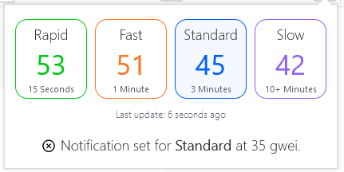

# Ethereum Gas Watcher

A browser addon to display the latest gas prices provided by [Gas Now](https://www.gasnow.org/).

Additionally, it is possible to set alerts that send notifications if the gas price drops below a certain threshold.

## Contributing
Feel free to contribute any code or fork this project. If you have ideas, open up an issue or contact me via twitter or telegram (@mat_nadler).

## Donating
If you found this extension useful, please consider donating to [matnad.eth](https://etherscan.io/address/0x1337c0de7360c041FC72B08b97DE0D88475A1c5B).